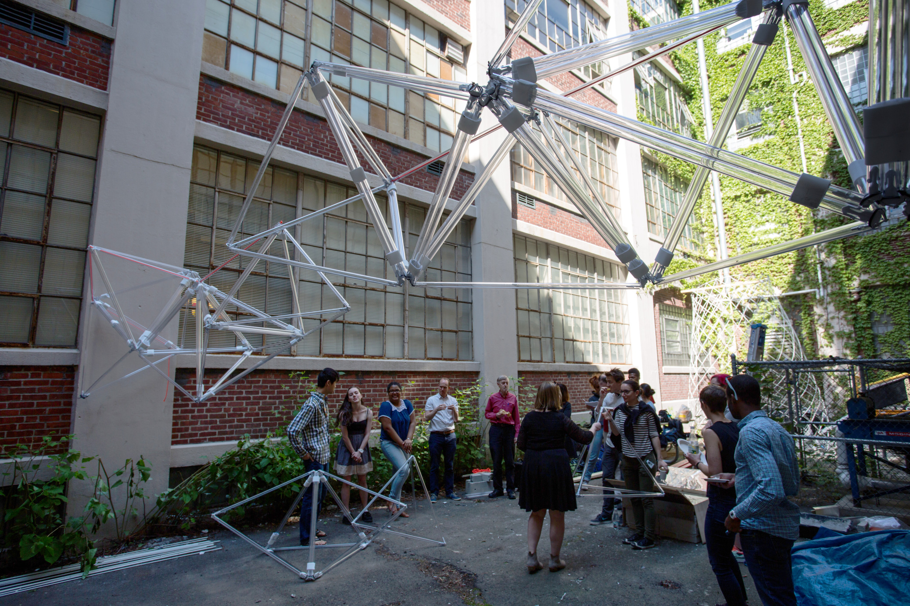
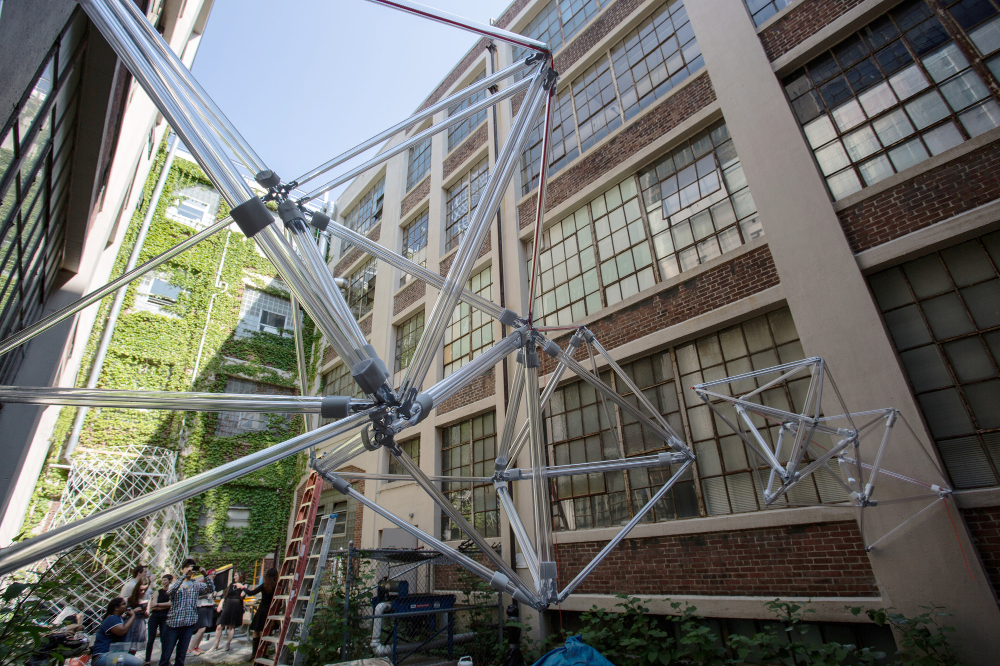
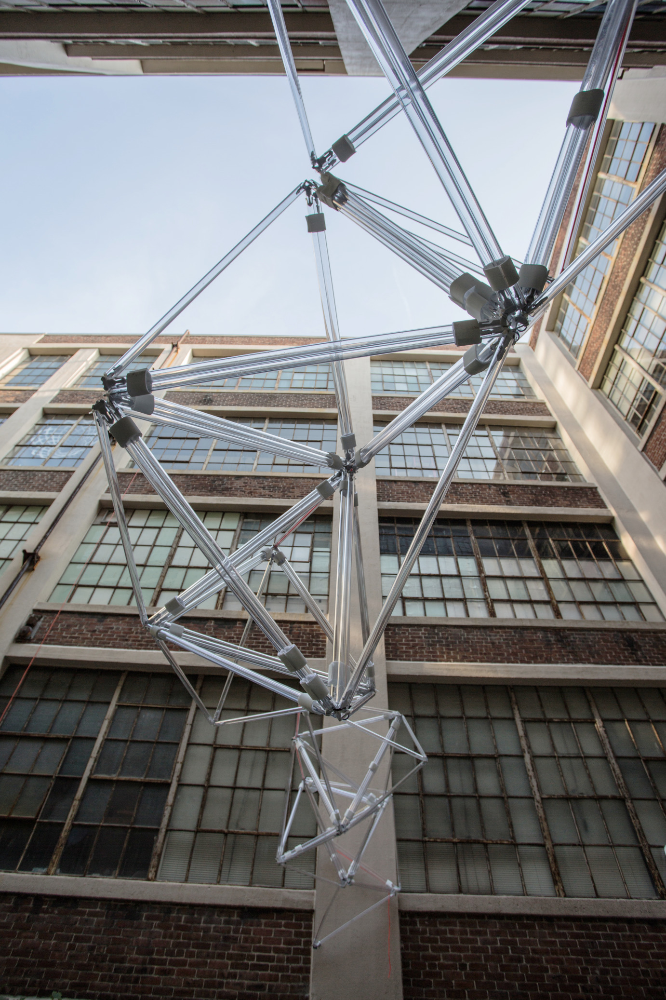
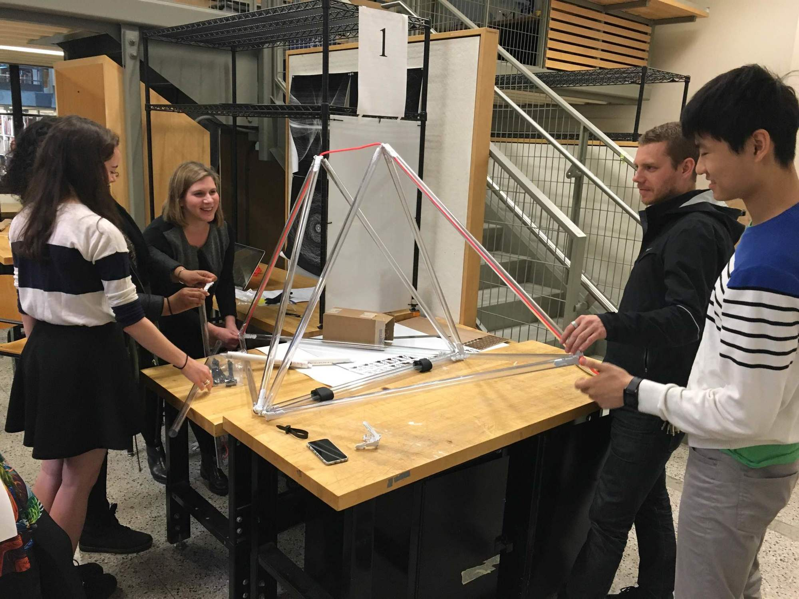
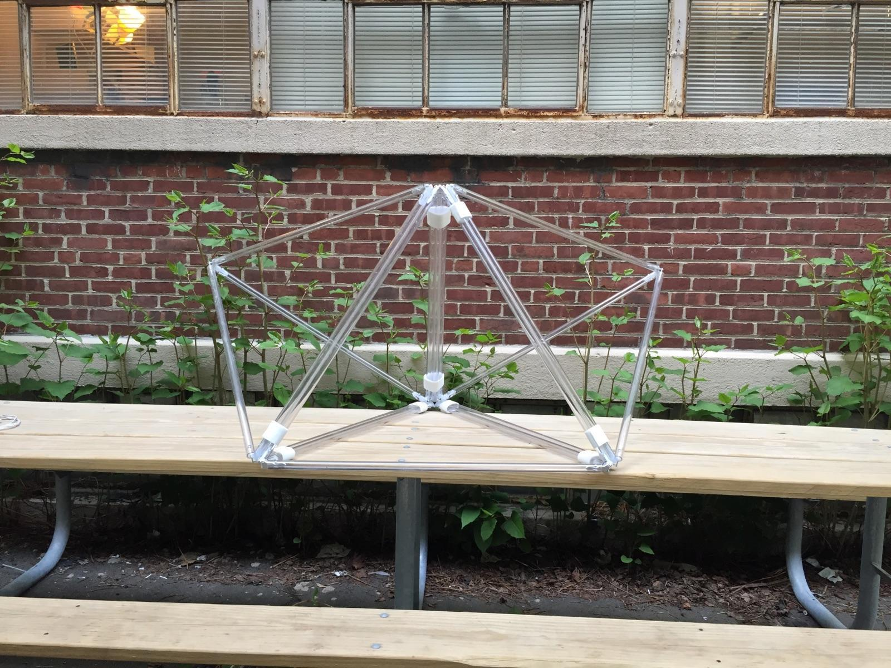
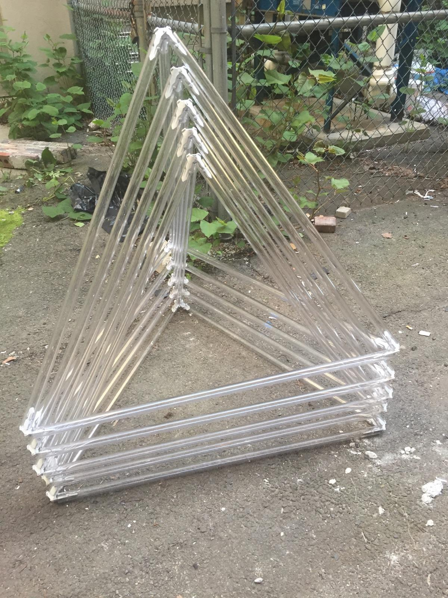

# Strength in Numbers

Strength in Numbers is a 24 foot spanning structure that is as modular as it is mobile. Its two symmetrical arms, each broken into four groups of three tetrahedral units, are able to curl up and down in response to tensioned control ropes. In addition, the structure is reversibly manufactured; using clear plastic tubes, velcro, knotted rope, and snap-in connectors, it can be broken apart into component pieces as easily as it is assembled and deployed.

[Read the Writeup](StrengthInNumbers.pdf)

---

## Behind the Scenes

Dimensions: Approx. 6m x 1.2m x 1.5m

Weight: Approx. 30kg

---

Assignment for: 4.101 Exploring Design (Final Project)

In Collaboration with: Lisbeth Acevedo, Hannah Lienhard

Learning Focus: Large Scale Fabrication, Computer Aided Design, Scale Models, Laser Cutting

Media: Spanning Structure, Intallation, Object

Software: Rhino, Blender, Adobe InDesign

Hardware: Machine Shop Tools, Laser Cutter

Date: May 2016

